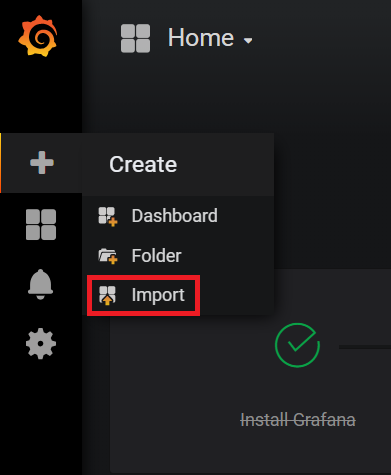

2. Import the [sample services grafana dashboard](https://github.com/citrix/netscaler-metrics-exporter/blob/master/sample_service_stats.json) or [sampe system grafana dashboard](https://github.com/citrix/netscaler-metrics-exporter/blob/master/sample_system_stats.json) by selecting the ```+``` icon on the left panel and clicking import.



3. A dashboard containing graphs similar to the following should appear

 
