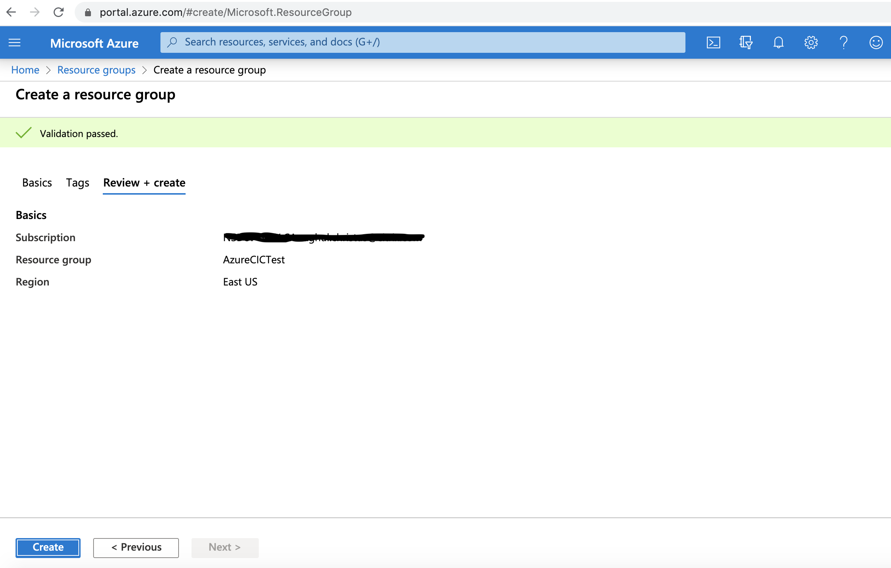
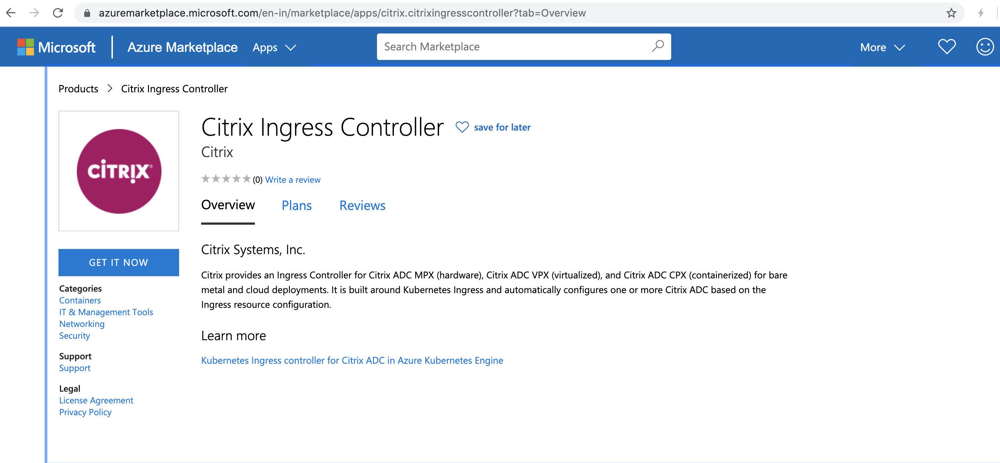
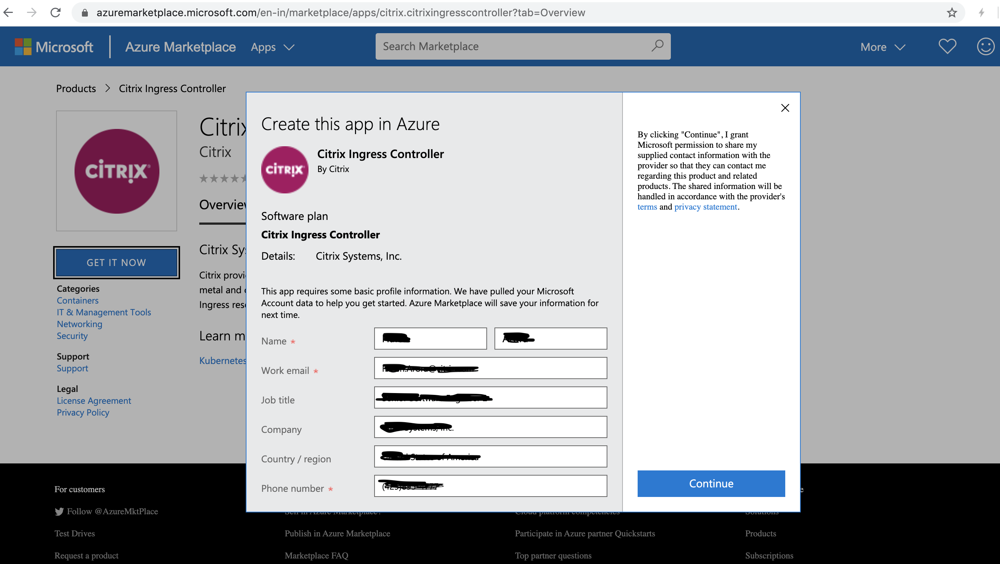
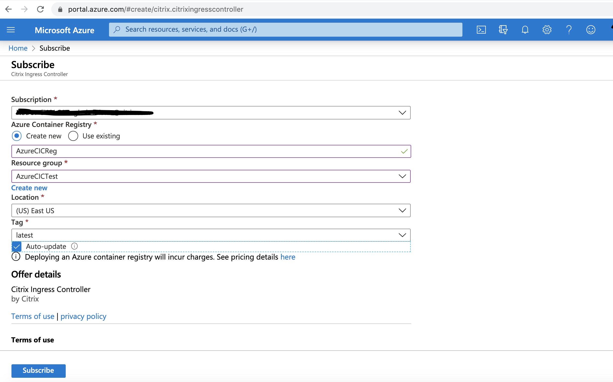
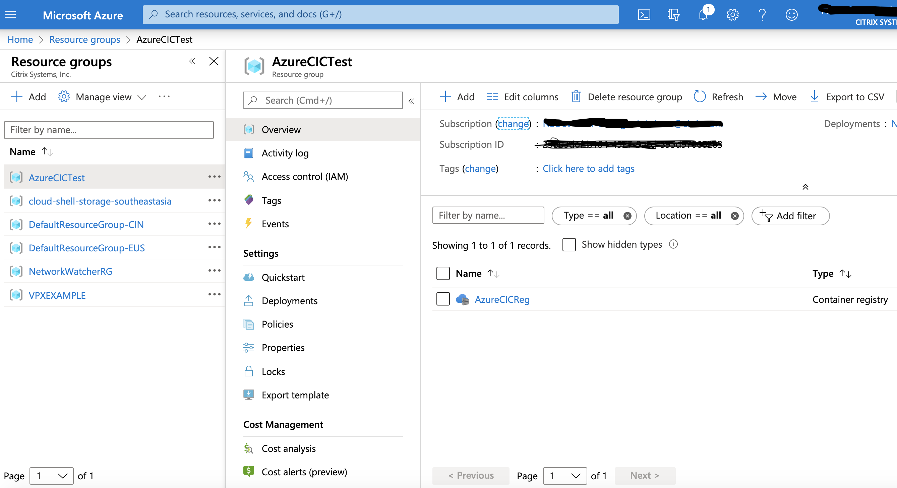
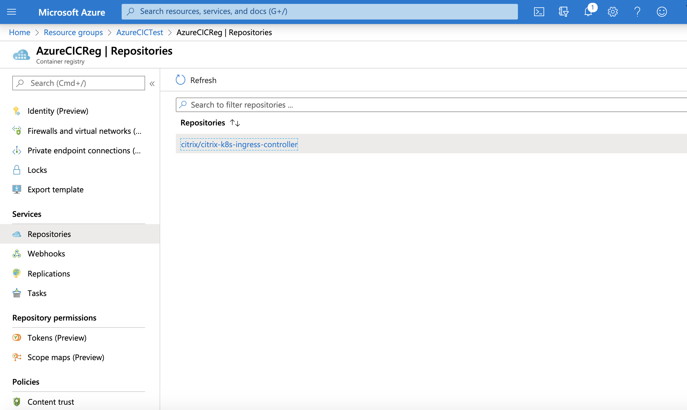
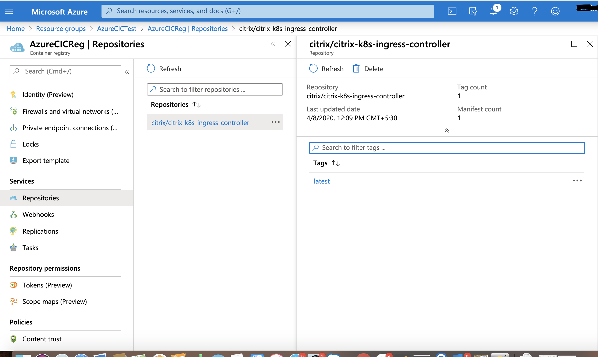
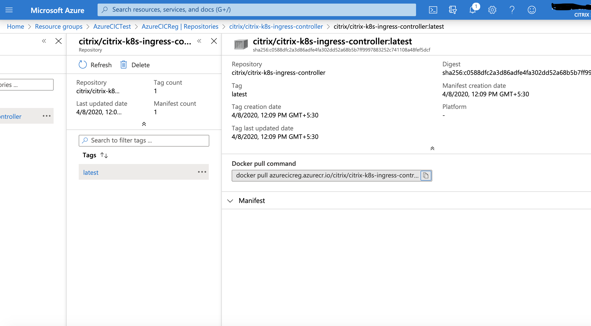

# Get Citrix ADC CPX Image URL on Azure Marketplace

This guide explains the steps to create the URL for Citrix ADC CPX image on Azure Markerplace.

#### Prerequisites:

- Valid Azure Marketplace account and Subscription

## Steps:

1. Login to your Azure Marketplace Account.
2. Create a Resource Group under your subscription.
   - Enter any name in Resource group Textbox and set a region.
      
   - Click on Review+create
   - Review the details and click on Create.
      
3. Select "Citrix ADC CPX" on Azure Marketplace
   
   - Click on "GET IT NOW"
   - Verify the details on pop-up and Click on "Continue"
   

4. Create CPX Image registry with the Resource Group created in step 2
   
   - Click on "Create new" for new Azure CPX Registry
   - Enter a Registry name
   - Select the Resource group name from Step 2 in Resource group dropdown
   - Set location
   - Keep the tag latest and selece auto update.
   - Verify your account details and click on "Subscribe"
     

5. Get the Repository Image URL
   - Go to Resouce Groups page and select the resource group created in Step 2.
   - From the right side column, select the registry created in Step 4.
     
   - Under "services" on Left column, click on "Repositories"
     
   - Find the "citrix/citrix-k8s-ingess-controller" under repositories and select it.
     
   - Now, select "latest" in the new right column.
     
   - Here, image URL is shared in "Docker pull command" text. Copy the same and replace as image in CIC yaml.
