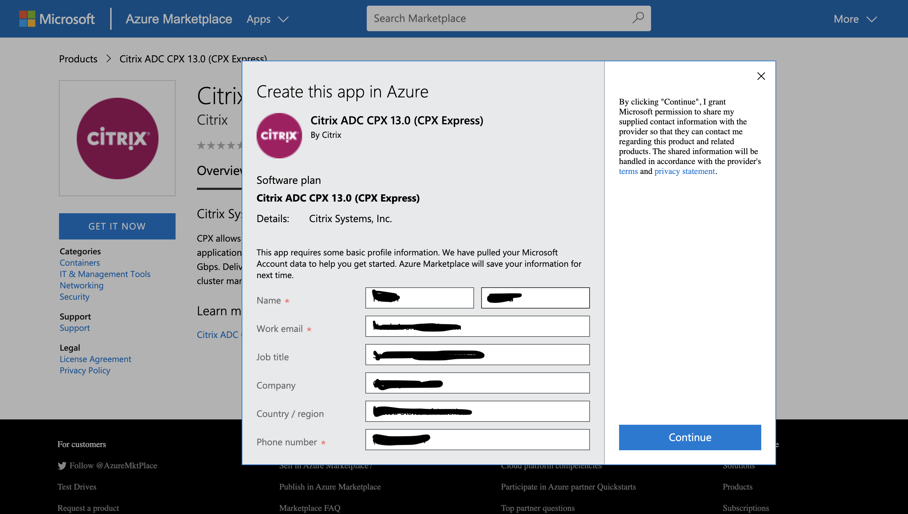
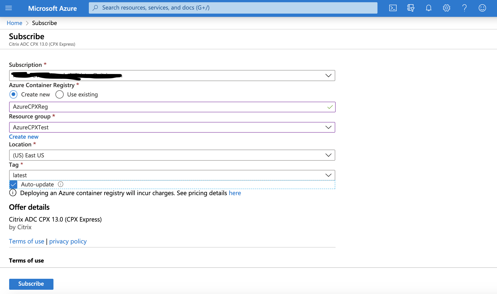
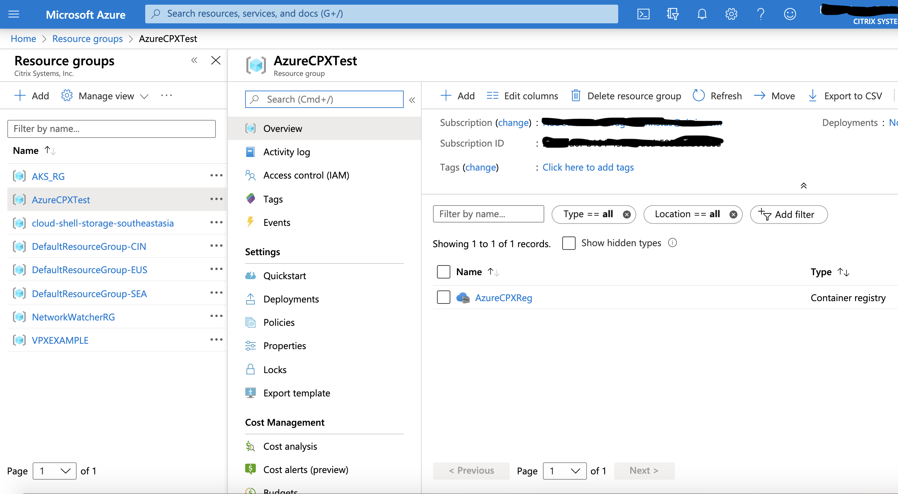
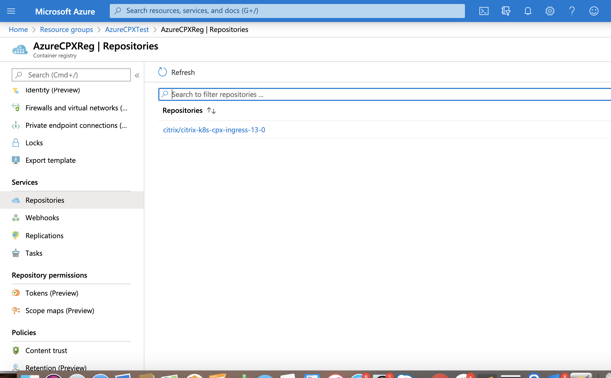
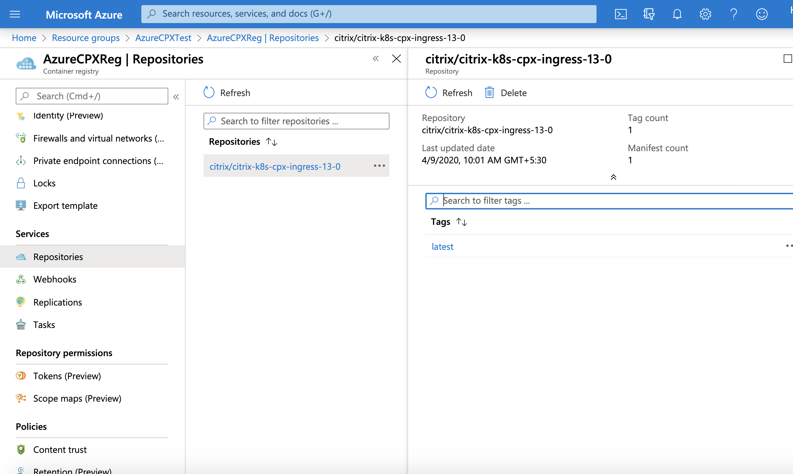
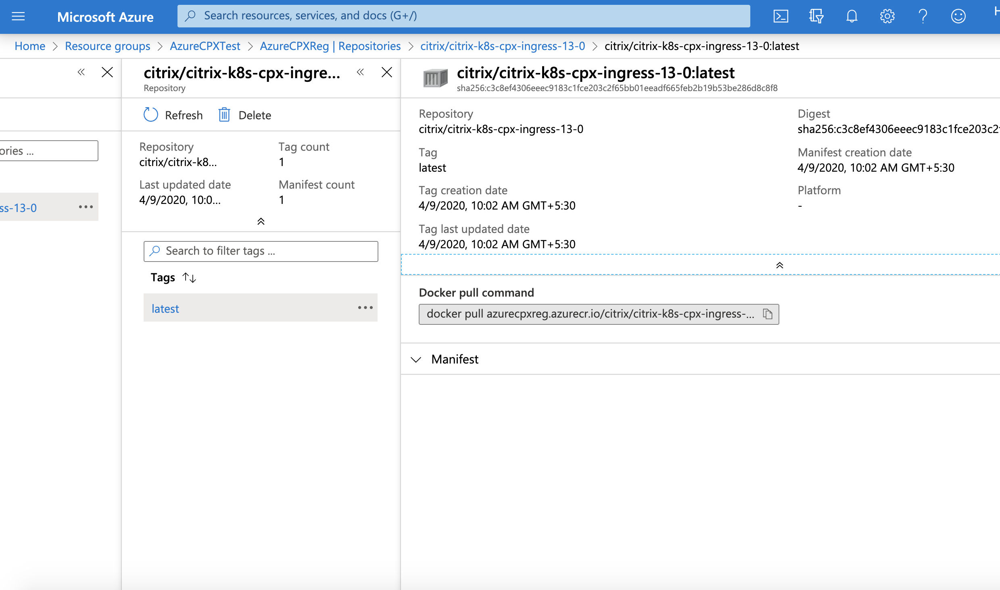

# Get Citrix ADC VPX on Azure Marketplace

This guide explains the steps to create Citrix ADC VPX on Azure Markerplace.

#### Prerequisites:

- Valid Azure Marketplace account and Subscription
- An existing Kubernetes cluster in Azure.

## Steps:

1. Login to your Azure Marketplace Account.
2. Locate the automatically created resource group as a part of creating the kuberentes cluster to be used with VPX. 
   - If the kubernetes cluster 'X' is a part of a resource group 'Y' in region 'Z' then look for a resource group starting          with "MC" followed ty "X_Y_Z" i.e with the format "MC_X_Y_Z"
   - For instance, 
       - cluster name is "cic-cluster-basic-1", 
       - resource group for the cluster is "AKS_RG", 
       - region used for cluster is 'southindia'
       then a new resouce group would have been automatically as "MC_AKS_RG_cic-cluster-basic-1_southindia"
     
3. Select "Citrix ADC VPX" on Azure Marketplace
   
   - Click on "GET IT NOW"
   - Verify the details on pop-up and Click on "Continue"
   

4. Create VPX Image registry with the Resource Group created in step 2
   
   - Click on "Create new" for new Azure VPX Registry
   - Enter a Registry name
   - Select the Resource group name from Step 2 in Resource group dropdown
   - Set location
   - Keep the tag latest and selece auto update.
   - Verify your account details and click on "Subscribe"
     

5. Get the Repository Image URL
   - Go to Resouce Groups page and select the resource group created in Step 2.
   - From the right side column, select the registry created in Step 4.
     
   - Under "services" on Left column, click on "Repositories"
     
   - Find the "citrix/citrix-k8s-cpx-ingress-13.0" under repositories and select it.
     
   - Now, select "latest" in the new right column.
     
   - Here, image URL is shared in "Docker pull command" text. Copy the same and replace as image in CIC yaml.
