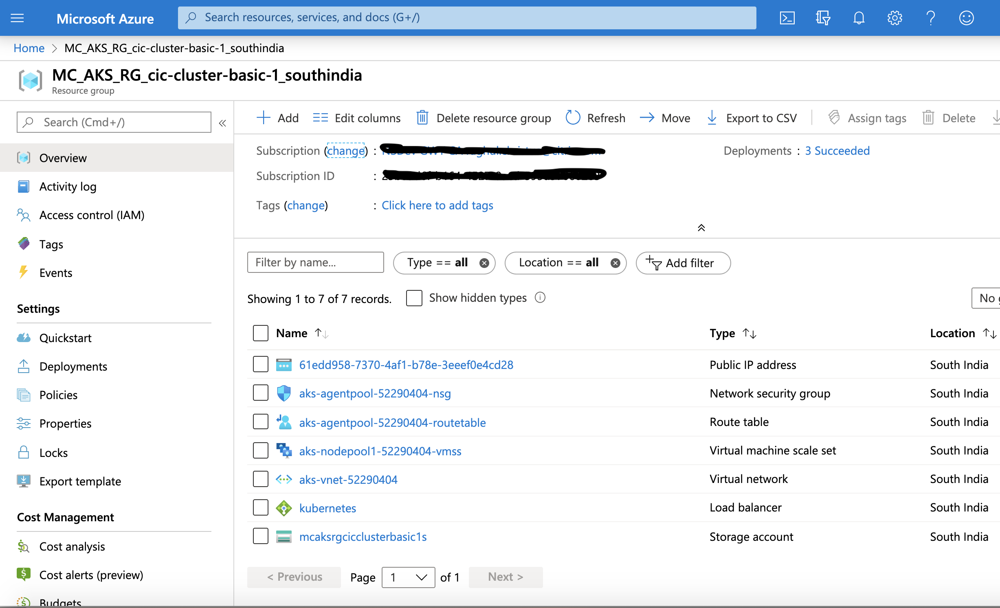
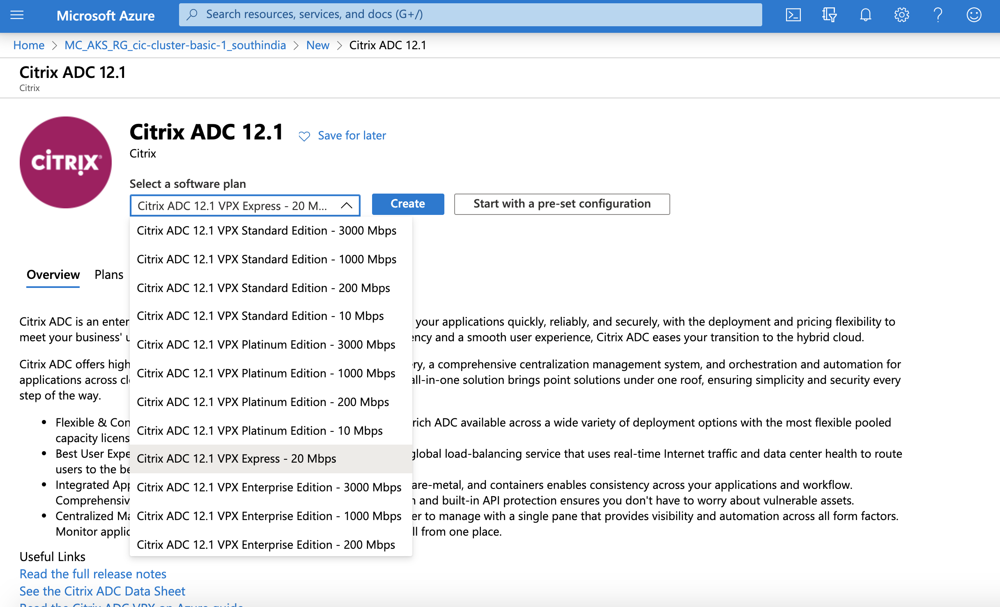
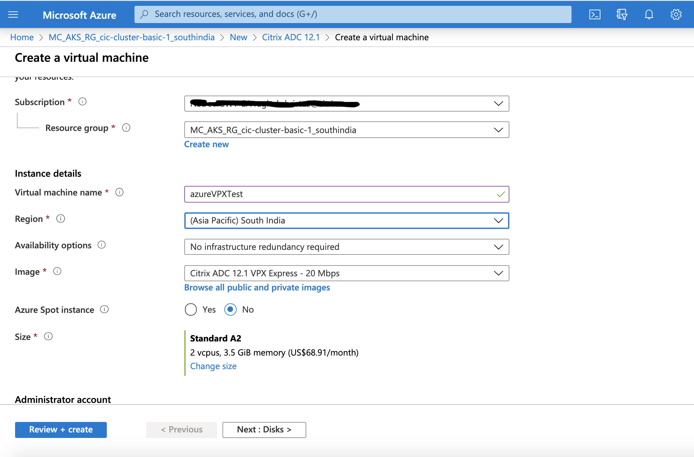
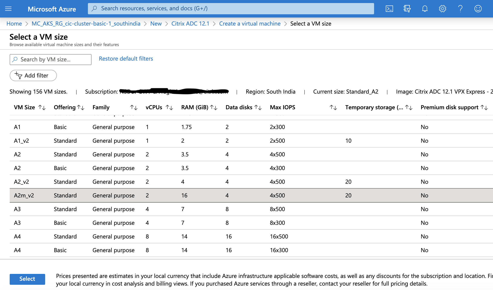
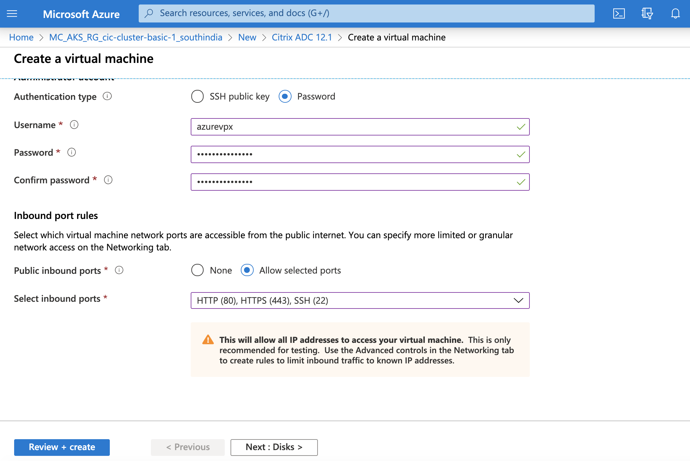

# Get Citrix ADC VPX on Azure Marketplace

This guide explains the steps to create Citrix ADC VPX on Azure Markerplace.

#### Prerequisites:

- Valid Azure Marketplace account and Subscription
- An existing Kubernetes cluster in Azure.

## Steps:

1. Login to your Azure Marketplace Account.
2. Locate the automatically created resource group as a part of creating the kuberentes cluster to be used with VPX. 
   - If the kubernetes cluster 'X' is a part of a resource group 'Y' in region 'Z' then look for a resource group starting          with "MC" followed ty "X_Y_Z" i.e with the format "MC_X_Y_Z"
   - For instance, if,
       - cluster name is "cic-cluster-basic-1", 
       - resource group for the cluster is "AKS_RG", 
       - region used for cluster is 'southindia'
       
     Then a resouce group would have been automatically created as "MC_AKS_RG_cic-cluster-basic-1_southindia"
     
3. Add VPX in the located resouce group in step 2.
   - From the resouce group page and click on "+Add"
   - Search for "Citrix ADC 12.1", select a software plan and click on "Create"
     

4. Fill in the detais for the VPX
   - Specify a "virtual machine name"
   - Specify a "Region" which should be same as that of the cluster
     
   - Specify a "Size" for the VPX 
     
   - You can select 'Password' as "Authentication Type"
   - Specify 'Username' and 'Password'
   - Do select all the relavant 'inbound ports' from Dropdown, then click "Next"
     
     
     

5. 
